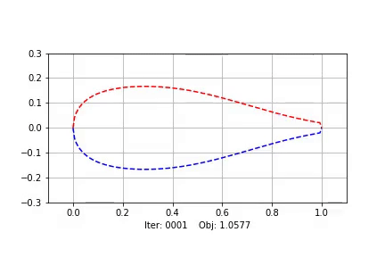

# Optimization of Low-Windspeed Bicycle Airfoils

Joint work with [Ethan](https://github.com/ezshen) for [AA222](https://aa222.stanford.edu)!

Check out our [report](report.pdf)!

Or check out some [plots & exploration](results/plotting.ipynb)!

The main script is [run.py](run.py). Interfacing with XFOIL is done in [xfoil/xfoil.py](xfoil/xfoil.py). If you're not on Mac, please replace `xfoil/xfoil` with an executable or binary containing the [XFOIL software](https://web.mit.edu/drela/Public/web/xfoil/). You can see the airfoil parameterization methods in [parameterizations](parameterizations).

Here's a visualization of truncated PARSEC optimization!

